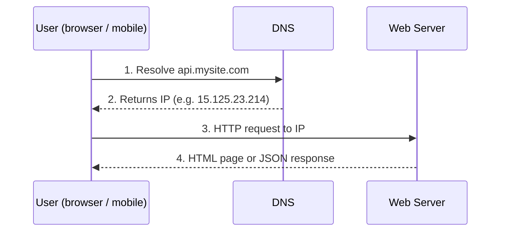
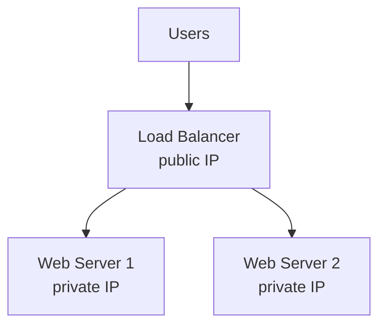
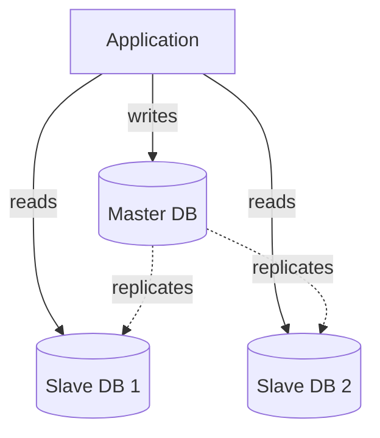
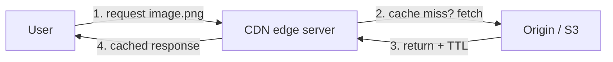
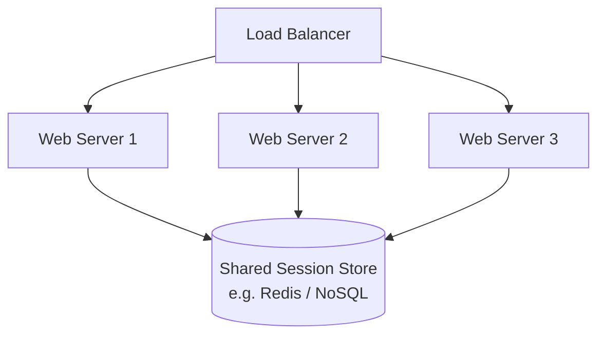
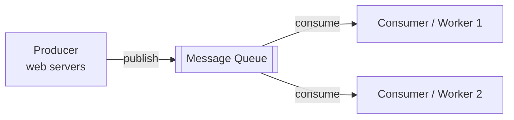
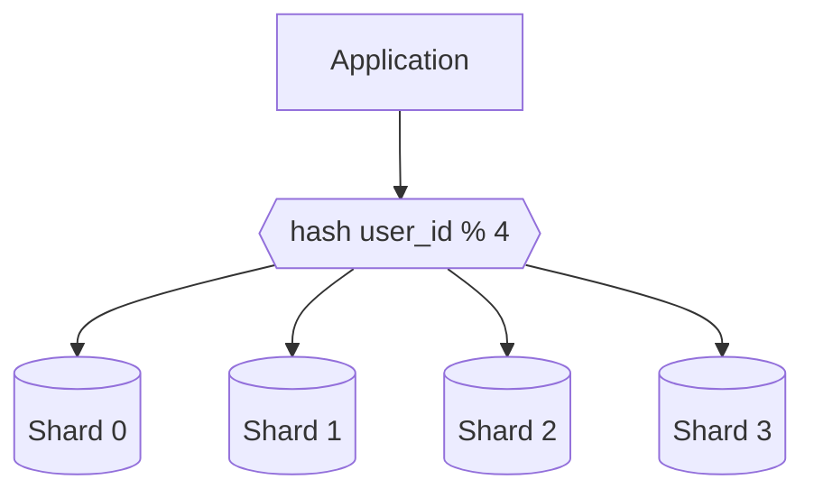
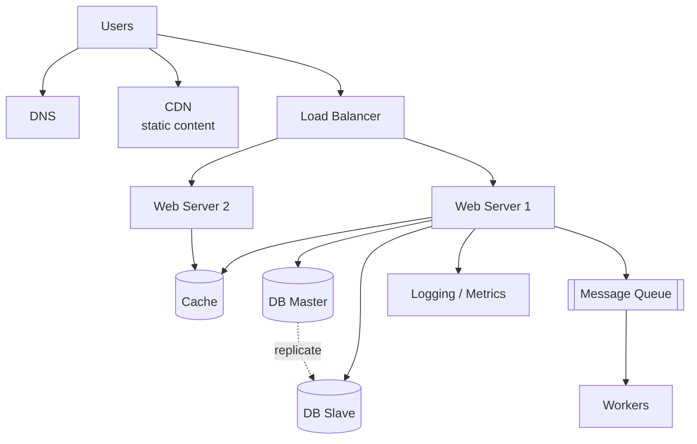

# Chapter 1 — Scale From Zero To Millions of Users

> **Big idea:** Designing a system that supports millions of users is a journey of
> continuous refinement. You start with a single server and progressively remove
> bottlenecks and single points of failure. This chapter is the "story" of that
> evolution — learn the *sequence*, not just the components.

---

## 1. Single Server Setup

Everything (web app, database, cache) runs on **one server**. Good enough for a first version.

**Request flow:**

- **DNS** is usually a *third-party paid service*, not hosted on your server.
- Two main traffic sources: **web application** (server-side languages + client-side
  HTML/JS) and **mobile app** (HTTP + JSON API).

---

## 2. Database — Separate the Data Tier

As users grow, split **web/mobile tier** from the **database tier** so each can scale
independently.

### Relational (RDBMS / SQL) vs Non-relational (NoSQL)

| | Relational (SQL) | Non-relational (NoSQL) |
|---|---|---|
| Examples | MySQL, PostgreSQL, Oracle | Cassandra, DynamoDB, MongoDB, Neo4j |
| Structure | Tables, rows, columns; **joins** | Key-value, document, column, graph |
| Strength | Structured data, ACID, complex queries | Massive scale, low latency, flexible schema |
| History | ~40+ years, battle-tested | Newer, built for scale |

**Choose NoSQL when:**
- You need **super-low latency**.
- Data is **unstructured** / no relational needs.
- You only serialize/deserialize data (JSON, XML, YAML).
- You need to store a **massive amount** of data.

> For most use cases, **relational databases are the best choice**. Reach for NoSQL
> only when RDBMS can't meet the specific requirement above.

---

## 3. Vertical vs Horizontal Scaling

| | Vertical scaling ("scale up") | Horizontal scaling ("scale out") |
|---|---|---|
| Meaning | Add more power (CPU/RAM) to one server | Add more servers to the pool |
| Pros | Simple when traffic is low | No hard ceiling; resilient |
| Cons | **Hard limit** (can't add infinite CPU); **no failover / redundancy** (single point of failure) | More complex to design |

> **Takeaway:** Vertical scaling is fine for small traffic but has a hard cap and no
> redundancy. Large-scale apps require **horizontal scaling**.

---

## 4. Load Balancer

A load balancer evenly distributes traffic across web servers behind it. Users hit the
load balancer's **public IP**; servers talk over **private IPs** (unreachable from the
internet → more secure).

- If **server 1 goes offline**, traffic routes to server 2 → **no more single point of failure**.
- Add more servers when traffic grows → load balancer handles the rest (graceful failover).

---

## 5. Database Replication

Typically a **master/slave** (leader/follower) relationship:

- **Master** → handles **writes** (INSERT, UPDATE, DELETE).
- **Slaves** → copy from master, handle **reads** only.
- Most apps have a **higher read:write ratio**, so slaves > masters.

**Advantages:** better performance (parallel reads), reliability (data survives disaster),
high availability (site stays up if one DB fails).

**Failover behavior:**
- If a **slave** goes down → reads redirect to other slaves / temporarily to master.
- If the **master** goes down → a slave is **promoted** to master (in reality more complex;
  may need data recovery / replaying update logs).

---

## 6. Cache Tier

A **cache** is a temporary, fast (in-memory) store of expensive/frequently-accessed results.
Reduces DB load and improves response time.

**Read-through cache flow:** web server checks cache → if hit, return; if miss, query DB,
store in cache, then return.

**Considerations when using a cache:**
- Use for **frequently read, infrequently modified** data (cache is not durable storage).
- Set an **expiration policy** (TTL) — not too short (thrashing), not too long (stale data).
- **Consistency**: keep cache & store in sync; hard across regions.
- **Mitigate failures**: a single cache node is a single point of failure → use multiple
  nodes / overprovision memory.
- **Eviction policies** (when cache is full): **LRU** (Least Recently Used, most popular),
  **LFU** (Least Frequently Used), **FIFO**.

---

## 7. CDN (Content Delivery Network)

Geographically distributed servers that cache **static content** (images, CSS, JS, video)
close to users.

**CDN considerations:**
- **Cost**: charged for data transfer — don't cache rarely-used assets.
- **Cache expiry (TTL)**: pick a sensible value.
- **CDN fallback**: clients should handle CDN outage by hitting the origin.
- **Invalidation**: purge via API or object versioning (e.g. `image.png?v=2`).

---

## 8. Stateless Web Tier

To scale the web tier horizontally, move **state (session data) out of web servers**.

- **Stateful** server: remembers a client's session → the same client *must* hit the same
  server (sticky sessions) → awkward to add/remove servers.
- **Stateless** server: session data lives in a **shared data store** (e.g. Redis,
  relational DB, NoSQL). Any server can handle any request → easy autoscaling.

---

## 9. Data Centers (Multi-region)

Serve users from the **geographically closest** data center via **geoDNS** (geo-routed DNS).

- Normal: users split across regions (e.g. `us-east`, `us-west`).
- **Failover**: if a data center is down, direct **all traffic** to a healthy one.

**Technical challenges:**
- **Traffic redirection** — geoDNS to route to the correct data center.
- **Data synchronization** — replicate data across regions (users in different regions
  may read different local DBs).
- **Test & deployment** — test in different locations; automated deployment keeps services
  consistent.

---

## 10. Message Queue

A durable, in-memory component supporting **asynchronous** communication. **Producers**
publish messages; **consumers** subscribe and process them.

**Why:** **decoupling** → producer and consumer scale independently. Producer can publish
even when consumers are down; consumers can read even when producer is down.

**Example:** photo processing (crop, sharpen, blur) — web server publishes a job; workers
process it asynchronously. Under load, add more workers to drain the queue faster.

---

## 11. Logging, Metrics, Automation

Essential once the system grows beyond a small scale:

- **Logging**: monitor error logs (per-server or aggregated into a central service).
- **Metrics**: host-level (CPU, RAM, disk I/O), aggregated (per-tier performance),
  business metrics (daily active users, retention, revenue).
- **Automation**: CI/CD, automated build/test/deploy to improve productivity.

---

## 12. Database Scaling — Sharding

When a single DB (even with replication) can't handle the load:

- **Vertical scaling** (bigger DB box): simple but has a hard ceiling, single point of
  failure, and high cost.
- **Horizontal scaling = Sharding**: split data across multiple DBs (shards). Each shard
  shares the same schema but holds a **different subset** of rows.

**Sharding key (partition key):** determines which shard a row goes to, e.g.
`shard = user_id % 4`.

**Challenges introduced by sharding:**
- **Resharding data**: when a shard fills up or data is uneven, you must add shards and move
  data → often solved with **consistent hashing** (Chapter 5).
- **Celebrity / hotspot problem**: a single popular row (e.g. a celebrity's data) overloads
  one shard → may need a dedicated shard or further partitioning.
- **Join & de-normalization**: cross-shard joins are hard → **denormalize** data so queries
  hit a single shard.

---

## 13. Putting It All Together

**Scaling web tier horizontally, the recap of moves:**
1. Keep web tier **stateless**.
2. Build **redundancy** at every tier.
3. **Cache** data as much as you can.
4. Support **multiple data centers**.
5. Host static assets in **CDN**.
6. **Shard** the data tier.
7. Split tiers into individual **services** (microservices).
8. **Monitor** the system and use **automation** tools.

---

## Cheat Sheet

| Problem | Solution |
|---|---|
| Web tier can't handle traffic | Load balancer + horizontal scaling |
| Server dies = outage | Redundancy at every tier (LB, replicas) |
| Too many DB reads | Read replicas (master/slave) |
| Repeated expensive reads | Cache tier (LRU eviction, TTL) |
| Slow static asset delivery | CDN |
| Can't autoscale web servers | Stateless web tier + shared session store |
| Regional latency / disaster | Multiple data centers + geoDNS |
| Heavy async work blocks requests | Message queue + workers |
| Single DB too big | Sharding (+ consistent hashing, denormalization) |
| Can't see what's failing | Logging, metrics, automation |

**Key terms:** vertical vs horizontal scaling · single point of failure · master/slave
replication · read:write ratio · LRU/LFU/FIFO eviction · TTL · stateless · geoDNS ·
producer/consumer · sharding key · celebrity problem · denormalization.

---

## Practice Questions

1. Your app suddenly has a 90% read / 10% write workload and the DB is overloaded. What's
   the *first* change you'd make, and why?
2. Explain why a **stateful** web tier makes horizontal scaling difficult. How does a shared
   session store fix it?
3. A CDN reduces latency but costs money. Which assets would you *not* put on a CDN?
4. You shard users by `user_id % 4`. A celebrity with 50M followers lands on shard 2 and it
   melts. Name two ways to handle this.
5. Why does adding read replicas *not* help write-heavy workloads? What would?
6. Walk through what happens (step by step) when the **master** database node fails.
7. Give one concrete example where a **message queue** improves user-perceived latency.
