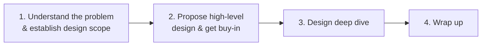
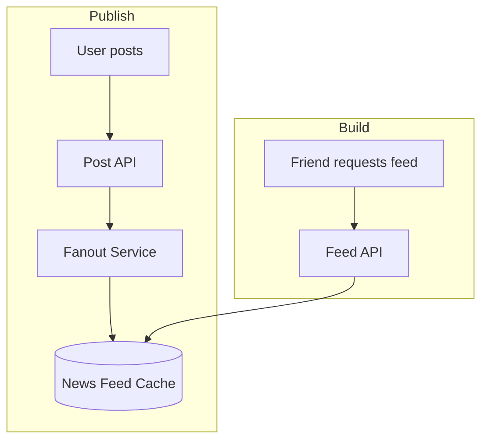

# Chapter 3 — A Framework for System Design Interviews

> **Big idea:** A system design interview is a **simulated collaboration** on an open-ended
> problem. There is **no single correct answer**. What's evaluated is your **process**: how
> you handle ambiguity, justify trade-offs, and collaborate under constraints. Red flags:
> tunnel vision on one aspect, over-engineering, and stubbornness.

---

## The 4-Step Process

Typical **45-minute** interview time budget:

| Step | Focus | ~Time |
|---|---|---|
| 1 | Understand problem & scope | 3–10 min |
| 2 | High-level design + buy-in | 10–15 min |
| 3 | Deep dive | 10–25 min |
| 4 | Wrap up | 3–5 min |

---

## Step 1 — Understand the Problem & Establish Design Scope

**Do not jump to a solution.** The #1 mistake is rushing to answer without clarifying.
Slow down, think deeply, and **ask questions** to nail down requirements and assumptions.

- There are **no wrong questions** here — asking clarifies requirements.
- The interviewer either answers or tells you to make assumptions. If they do, **write the
  assumptions down** on the board.

**Questions to consider asking:**
- What **specific features** are we building?
- How many **users** does the product have?
- How fast is the company expected to **scale** (1 month / 6 months / 1 year)?
- What is the company's **tech stack**? Existing services you can leverage?

**Example — "design a news feed":**
- Mobile app? Web? Both?
- Most important features?
- Chronological order or ranked (weighted) order?
- How many friends max per user?
- Traffic volume (DAU)?
- Does the feed contain images/videos, or text only?

---

## Step 2 — Propose High-Level Design & Get Buy-In

Collaborate with the interviewer — treat them as a **teammate**. Aim for an **initial
blueprint** and **feedback**.

- **Draw box diagrams** of key components: clients, API servers, data stores, cache, CDN,
  message queue, etc.
- **Do back-of-the-envelope estimates** to evaluate whether the design fits scale
  constraints (see Chapter 2). Think out loud; check with the interviewer whether it's
  appropriate here.
- If possible, **walk through a few concrete use cases** — this shapes the design and often
  surfaces edge cases.
- Decide whether to include **API endpoints** and the **database schema** — depends on
  problem size (fine for something like a URL shortener; too detailed for whole-of-Google).

**Example — news feed high-level design has two flows:**
- **Feed publishing**: user posts → data written to cache/DB → populated into friends' feeds.
- **Feed building**: aggregate friends' posts in reverse-chronological order.

---

## Step 3 — Design Deep Dive

By now you have agreed on: overall goals/scope, a high-level blueprint, feedback, and
initial areas to focus on. Now **go deep** together.

**What deep dives look like (examples):**
- **System performance** characteristics (latency, throughput).
- Specific **components** in depth (e.g. for a URL shortener → the hash function that
  converts long URLs to short URLs).
- **Edge cases** and how the system handles them.

> **Watch the clock.** Don't get dragged into unnecessary detail (e.g. spending too long on
> a tangential optimization). Demonstrating scalable-design ability matters more than tiny
> details, and rambling reflects poorly.

**Example — news feed deep dives:** the **feed publishing flow** and the **news feed
retrieval flow** in detail (fanout-on-write vs fanout-on-read, cache structure, etc.).

---

## Step 4 — Wrap Up

Use the last few minutes to demonstrate maturity and forward-thinking. The interviewer may
ask follow-ups or let you talk. Consider these directions:

- **Identify bottlenecks** and discuss potential **improvements**. There's always more to
  improve — stay open, never claim the design is perfect.
- **Recap** your design — helpful to the interviewer after a long discussion.
- Discuss **error cases**: server failure, network loss, etc.
- Discuss **operational issues**: monitoring metrics, error logs, how you'd **roll out**.
- Discuss how to handle the **next scale curve** (e.g. going from 1M → 10M users).
- Propose **further refinements** you'd make with more time.

---

## Dos and Don'ts

**Do:**
- Always **ask for clarification**; don't assume your assumption is correct.
- Understand the **requirements** of the problem.
- Remember there's **no single best answer** — a solution for a young startup differs from
  one for an established company with millions of users.
- **Communicate** — let the interviewer know what you're thinking.
- **Suggest multiple approaches** when possible.
- Once the blueprint is agreed, go into **details** on the most critical components.
- **Bounce ideas off** the interviewer — treat them as a teammate.
- **Never give up.**

**Don't:**
- Be **unprepared** for typical interview questions.
- **Jump into a solution** without clarifying requirements/assumptions.
- Go into **too much detail on a single component** first — give the high-level design first.
- If you get **stuck**, don't hesitate to ask for hints.
- **Communicate silently** — don't think in your head without talking.
- Think you're **done once the design is given** — keep refining until the interviewer says
  time is up.

---

## The Checklist (print this)

**Step 1 — Scope**
- [ ] Clarify features / most important functionality
- [ ] Ask about users, DAU, and scale expectations
- [ ] Ask about existing tech stack / reusable services
- [ ] Write assumptions on the board

**Step 2 — High-level design**
- [ ] Draw box diagram of major components
- [ ] Define APIs (if appropriate)
- [ ] Sketch data model / schema (if appropriate)
- [ ] Do back-of-the-envelope estimation
- [ ] Walk through a concrete use case, get buy-in

**Step 3 — Deep dive**
- [ ] Pick the critical components to expand
- [ ] Discuss trade-offs of alternatives
- [ ] Handle edge cases & bottlenecks
- [ ] Manage time — don't over-detail

**Step 4 — Wrap up**
- [ ] Recap the design
- [ ] Identify bottlenecks + improvements
- [ ] Error cases (failure, network loss)
- [ ] Monitoring, metrics, rollout
- [ ] How to scale to the next 10×

---

## Cheat Sheet

**The 4 steps:** Scope → High-level design (buy-in) → Deep dive → Wrap up.

**Golden rules:**
- No single correct answer — justify **trade-offs**.
- **Clarify before designing.** Ask questions; write assumptions.
- **Communicate constantly** — collaboration is being tested.
- **Manage the clock** — high-level first, then targeted depth.
- **Never claim "done"** — always propose improvements.

---

## Practice Questions

1. List 4 clarifying questions you'd ask before designing a **URL shortener**.
2. You have 45 minutes. Roughly how would you allocate time across the 4 steps, and why?
3. Give an example of **over-engineering** in a system design interview and why it's a red flag.
4. In the wrap-up, name three "operational" topics worth raising even if unprompted.
5. Why is jumping straight into database schema design usually a mistake in Step 1–2?
6. You realize mid-interview your initial design won't scale. What do you do — and what
   should you *not* do?
